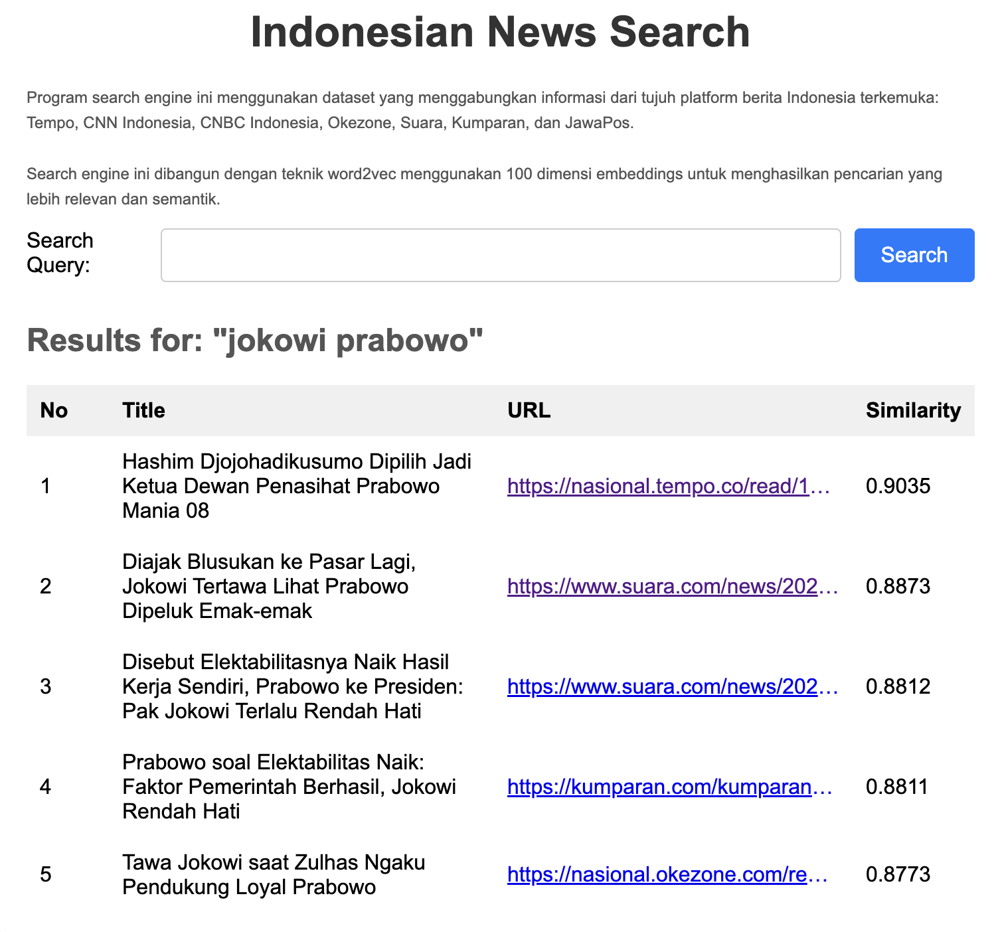

# Indonesian News Search Engine

This search engine program uses a dataset that combines information from seven leading Indonesian news platforms:

- Tempo
- CNN Indonesia
- CNBC Indonesia
- Okezone
- Suara
- Kumparan
- JawaPos

The search engine is built using the **word2vec** technique with 100-dimensional embeddings to produce more relevant and semantic search results. By utilizing this technique, the system can understand semantic relationships between words, providing search results that are more contextually accurate based on meaning, rather than just exact keyword matches.

## Key Features
- **Dataset**:  Uses up-to-date information from the [Indonesian News Dataset](https://www.kaggle.com/datasets/iqbalmaulana/indonesian-news-dataset).
- **Word2Vec Embeddings**: Implements the **word2vec** model with 100 dimensions to create word representations in vector form that capture semantic meaning.
- **Relevant Search**: Delivers search results based on semantic similarity, not just keyword matching.
- **User-Friendly**: Easy-to-use interface to search for news articles based on keywords.

## Screenshot Demo
Here is a screenshot of the search engine interface:



## How to Use
1. Enter a search keyword in the available search box on the homepage.
2. Click the **Search** button to retrieve search results.
3. The search results will display the title, URL, and similarity score of each article to the input keyword.

## Technologies Used
- **Python**: The primary programming language for the backend.
- **Flask**: Framework used to build the web application.
- **Word2Vec**: To generate word embeddings based on context.
- **Pandas**: For data processing and dataset manipulation.
- **Sklearn**: For measuring document similarity using cosine similarity.

## Installation and Setup
1. **Clone the repository**:
    ```bash
    git clone https://github.com/username/repository-name.git
    cd repository-name
    ```

2. **Install dependencies**:
    ```bash
    pip install -r requirements.txt
    ```

3. **Run the application**:
    ```bash
    python main.py
    ```

4. Open the application in your browser at `http://127.0.0.1:5000`.

## Contributing
If you want to contribute to this project, you can **fork** this repository and then submit a **pull request** with any changes or new features you would like to add.

## License
This project is licensed under the MIT License. See the [LICENSE](LICENSE) file for more details.
